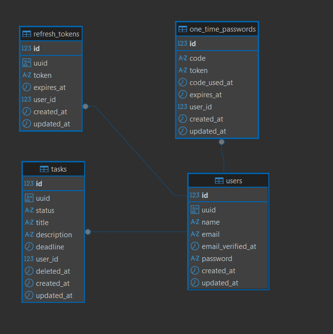
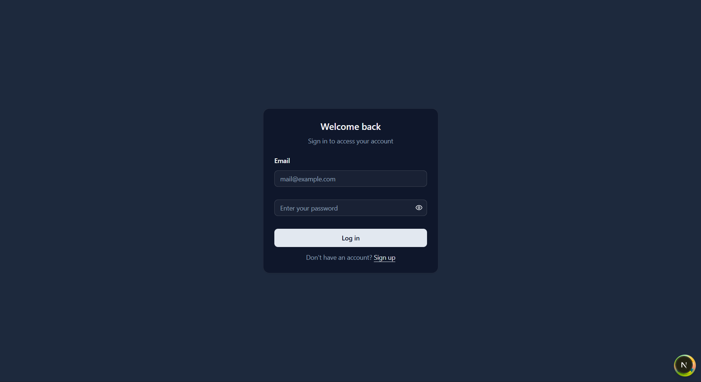
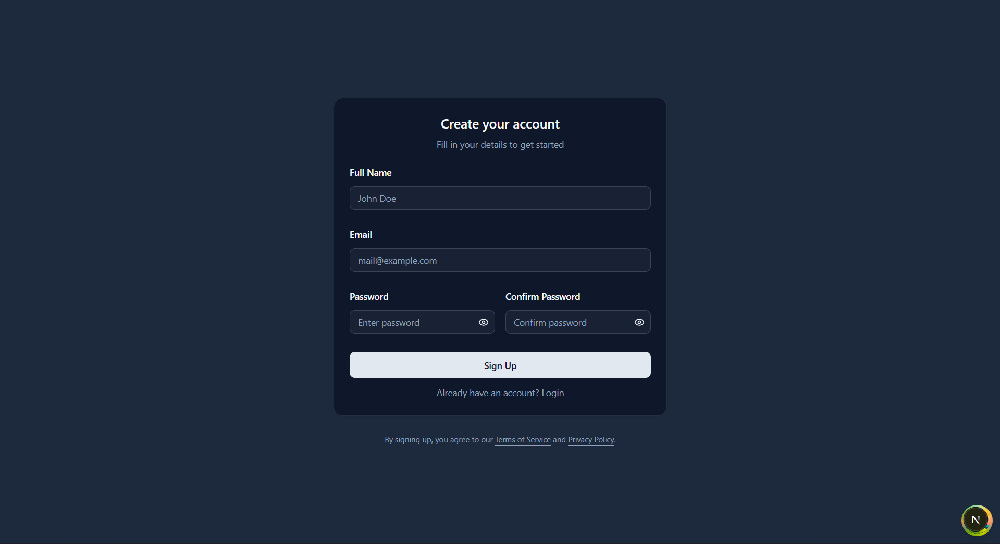
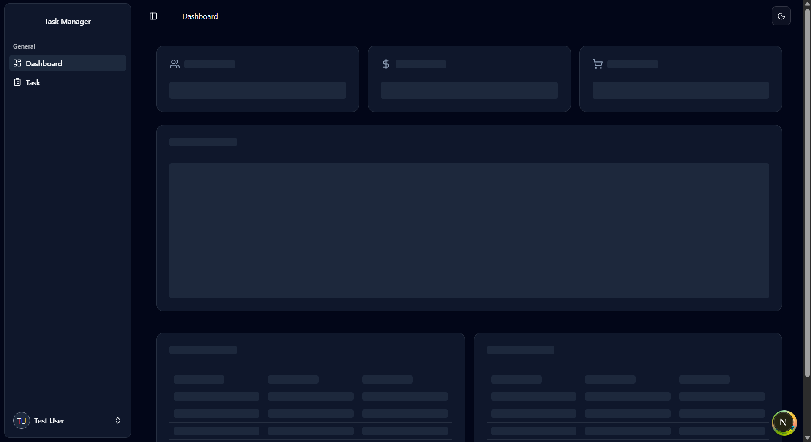
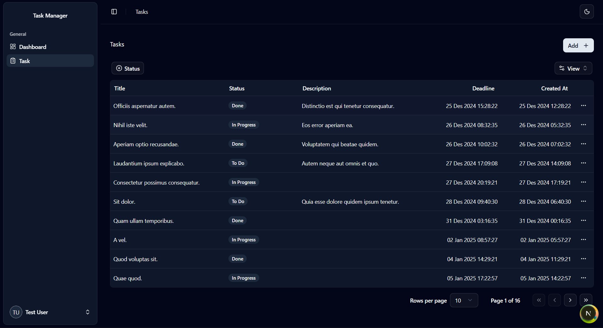
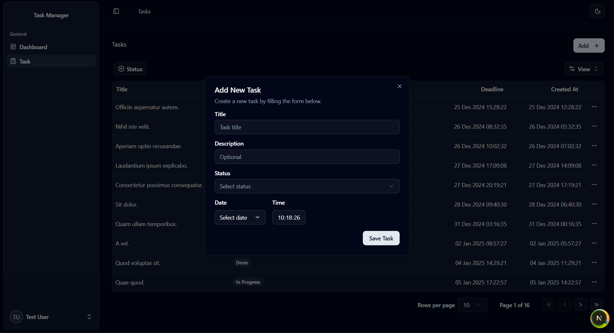
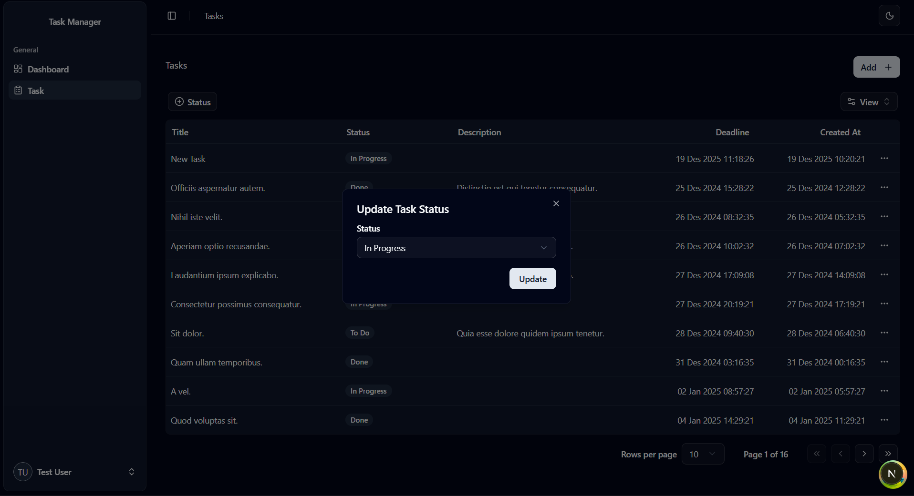
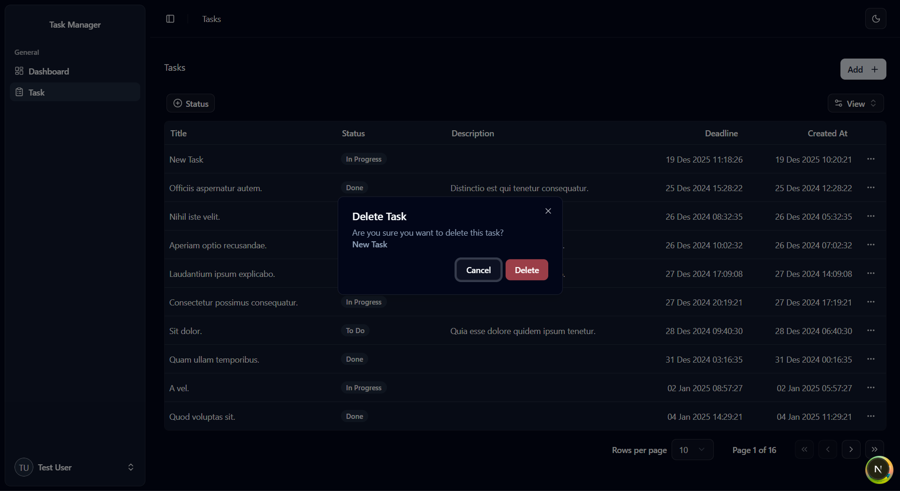

# Task Management Application Documentation

## 1. Application Overview

Task Management Application is a web-based system designed to help users manage daily tasks efficiently.

Features:
- User registration and authentication
- View task list
- Create new tasks
- Update task status
- Delete tasks
- Filter and search tasks

Architecture:
- Backend: Laravel REST API
- Frontend: Next.js

---

## 2. How to Run the Application

The application consists of two parts:
- Backend (Laravel)
- Frontend (Next.js)

---

## 3. Backend Setup (Laravel)

### Requirements
- PHP >= 8.2
- Composer
- PostgreSQL or MySQL

### Installation Steps

```bash
git clone <repository-url>
cd backend
composer install
cp .env.example .env
php artisan key:generate
```

### Environment Configuration

```env
APP_NAME=TaskManagement
APP_ENV=local
APP_DEBUG=true
APP_URL=http://127.0.0.1:8000

DB_CONNECTION=pgsql
DB_HOST=127.0.0.1
DB_PORT=5432
DB_DATABASE=task_management
DB_USERNAME=postgres
DB_PASSWORD=

JWT_SECRET=your-jwt-secret
```

### Database Migration and Seeder

```bash
php artisan migrate --seed
```

### Run Backend Server

```bash
php artisan serve
```

Backend will be available at:
http://127.0.0.1:8000

### Run Queue Worker

```bash
php artisan queue:work
```

---

## 4. Frontend Setup (Next.js)

### Requirements
- Node.js >= 18
- pnpm

### Installation Steps

```bash
cd ../frontend
pnpm install
```

### Environment Configuration

Create `.env.local` file:

```env
NEXT_PUBLIC_API_BASE_URL=http://127.0.0.1:8000/api/v1
```

### Run Frontend Server

```bash
pnpm run dev
```

Frontend will be available at:
http://localhost:3000

---

## 5. Dummy Login Information

```text
Email    : test@example.com
Password : password
```

---

## 6. Database Structure



---

## 7. Postman Collection
Postman collection for testing the API endpoints is available [here](./Task_Management_API.postman_collection.json). Import this file into Postman to access all the API routes for testing.``

---

## 8. Application Screenshots

Screenshots are stored in the `screenshot` directory.

### Login


### Register


### Dashboard


### Task List


### Add Task


### Update Task


### Delete Task


---

## 9. Technology Stack

### Backend
- Laravel 12
- PostgreSQL
- JWT Authentication
- Laravel Queue

### Frontend
- Next.js (App Router)
- TypeScript
- React Hook Form
- Zod
- TanStack React Query
- TanStack React Table
- Tailwind CSS
- shadcn/ui

---

## 10. Conclusion

This document provides complete instructions to run, test, and understand the Task Management Application, including setup steps, database structure, API testing using Postman, and UI screenshots.
